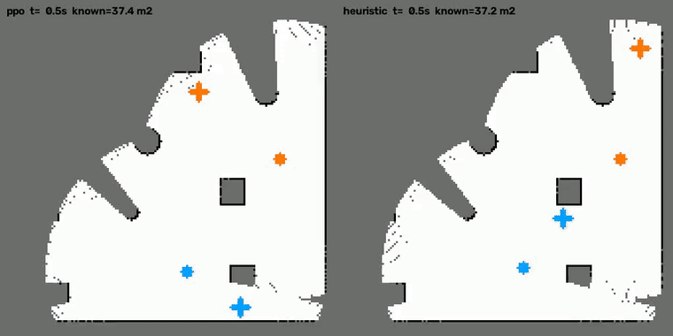
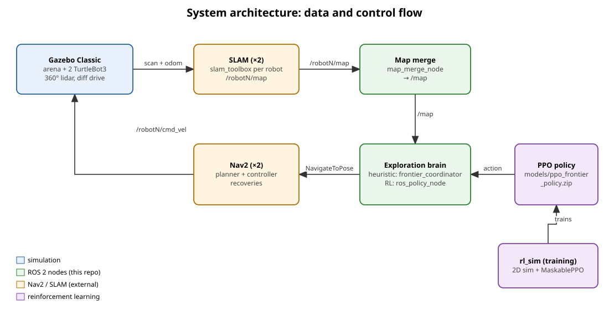
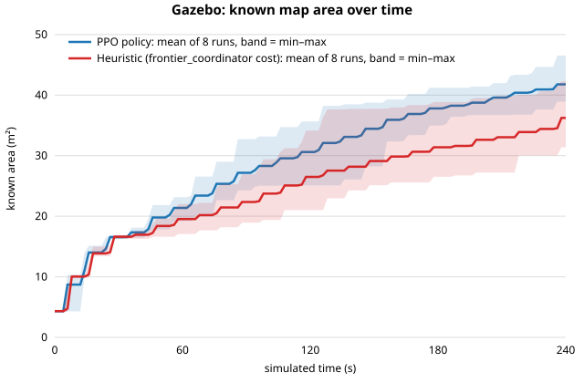
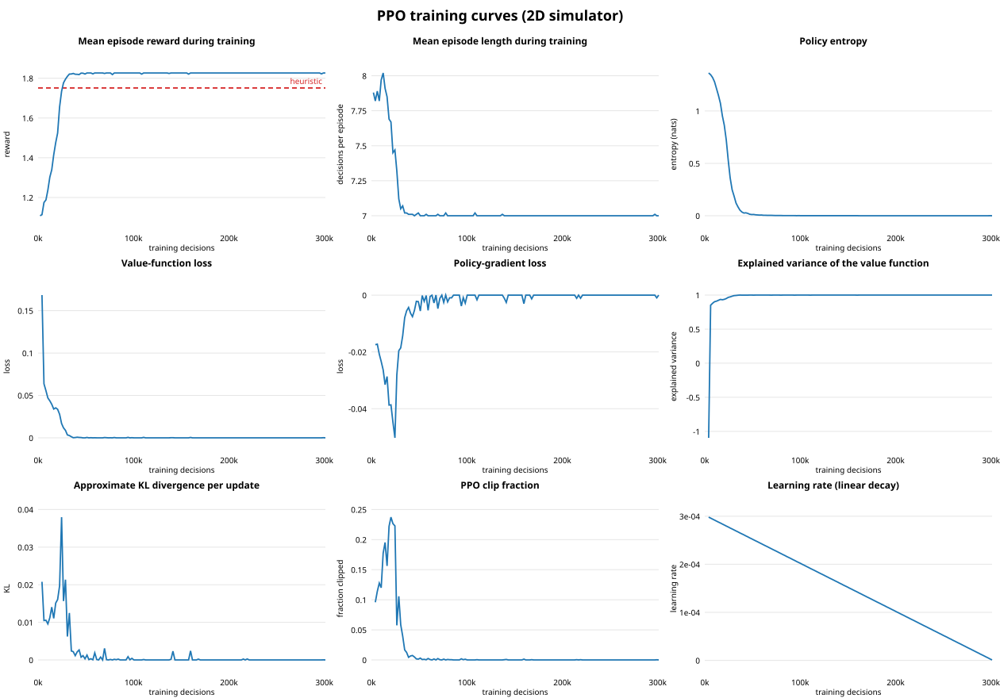

# Multi-Robot Autonomous Frontier Exploration

**Two TurtleBot3 robots cooperatively map an unknown arena with ROS 2 Humble: Gazebo simulation, per-robot SLAM, map merging, Nav2 navigation, and a frontier-selection "brain" that is either hand-designed (heuristic) or learned with reinforcement learning (PPO).**

On the benchmark arena, the PPO policy mapped **15 % more area in 240 s** than the heuristic. It was better in **8/8** paired Gazebo runs (p = 0.008), and reached 30 m² **30 % sooner**. Full report: [docs/heuristic-vs-rl.md](docs/heuristic-vs-rl.md).



---

## Contents
1. [How the system works](#1-how-the-system-works)
2. [Setup and dependencies](#2-setup-and-dependencies)
3. [How to run](#3-how-to-run)
4. [Code structure](#4-code-structure)
5. [Results](#5-results)
6. [Demo videos](#6-demo-videos)
7. [Configuration reference](#7-configuration-reference)
8. [Troubleshooting](#8-troubleshooting)
9. [Known limitations and next steps](#9-known-limitations-and-next-steps)

---

## 1. How the system works



| Layer | Component | What it does |
|---|---|---|
| Simulation | Gazebo Classic, `spawn_two_turtlebots.launch.py`, `generate_random_world.py` | Builds a random 8 × 8 m arena with box and cylinder obstacles, and spawns two namespaced TurtleBot3 Burgers (`robot1`, `robot2`) with lidar |
| Mapping | `slam_toolbox` ×2, `multi_robot_slam.launch.py` | Each robot builds its own occupancy map, `/robotN/map` |
| Map merging | `map_merge_node.py` | Fuses both maps into one `/map` (occupied wins), and publishes the static TF `map → robotN/map` |
| Navigation | Nav2 ×2, `nav2_bringup_multi.launch.py` | Theta* global planner, DWB controller, recoveries; accepts `NavigateToPose` goals |
| Exploration brain | `frontier_coordinator.py` **or** `rl_sim/ros_policy_node.py` | Detects frontiers (known/unknown boundaries) on `/map`, and decides which frontier each robot should drive to next |

**The two brains:**
- **Heuristic** (`frontier_coordinator.py`): picks the frontier with the lowest `cost = distance + 50 / d(other robot's goal) + 50 · (metres into the other robot's half)`. It replans every 3 s, detects stuck robots, blacklists failed goals, and publishes RViz markers.
- **RL** (`rl_sim/`): a PPO policy picks one of the 12 nearest reachable frontiers from 153 features. It was trained in a fast 2D simulator of the arena (`rl_sim/envs/frontier_env.py`), which uses the same frontier detection, a 3.5 m lidar model and A* motion. `ros_policy_node.py` rebuilds exactly the same observation from the live `/map`, TF and Nav2 state every second, so the trained policy runs on the full stack unchanged.

**More detailed diagrams** (in [`docs/architecture/`](docs/architecture/), from the system level down to individual functions):

| Diagram | Level |
|---|---|
| [01_system_overview.svg](docs/architecture/01_system_overview.svg) | subsystems and data/control flow |
| [02_ros_graph.svg](docs/architecture/02_ros_graph.svg) | ROS 2 nodes, topics and actions |
| [03_tf_tree.svg](docs/architecture/03_tf_tree.svg) | coordinate frames |
| [04_rl_pipeline.svg](docs/architecture/04_rl_pipeline.svg) | train in 2D → deploy in Gazebo → evaluate |
| [05_policy_node_tick.svg](docs/architecture/05_policy_node_tick.svg) | function level: one decision of the RL node |
| [06_env_step.svg](docs/architecture/06_env_step.svg) | function level: one step of the training environment |
| [07_coordinator_replan.svg](docs/architecture/07_coordinator_replan.svg) | function level: the heuristic replan loop |

Regenerate them with `python3 docs/architecture/make_diagrams.py`.

---

## 2. Setup and dependencies

**Platform:** Ubuntu 22.04 with ROS 2 Humble and Gazebo Classic 11. On another Linux distribution, use a distrobox with Ubuntu 22.04 (`distrobox enter ros-humble` in every terminal).

```bash
# ROS packages
sudo apt install -y ros-humble-desktop ros-humble-gazebo-ros-pkgs \
  ros-humble-turtlebot3-gazebo ros-humble-turtlebot3-description \
  ros-humble-navigation2 ros-humble-nav2-bringup ros-humble-slam-toolbox \
  ros-humble-rmw-cyclonedds-cpp python3-numpy python3-opencv python3-colcon-common-extensions

# Python packages for the RL part (CPU-only PyTorch is enough)
pip3 install --user torch --index-url https://download.pytorch.org/whl/cpu
pip3 install --user -r rl_sim/requirements.txt
pip3 uninstall -y setuptools      # torch installs a setuptools that breaks colcon on Humble

# Build (final-product/ is the ROS 2 workspace and the package root)
cd ~/swarm/final-product
source /opt/ros/humble/setup.bash
colcon build --symlink-install
source install/setup.bash
```

Add these lines to `~/.bashrc` so every terminal is ready:
```bash
source /opt/ros/humble/setup.bash
source ~/swarm/final-product/install/setup.bash
export TURTLEBOT3_MODEL=burger
export GAZEBO_MODEL_PATH=$GAZEBO_MODEL_PATH:/opt/ros/humble/share/turtlebot3_gazebo/models
export RMW_IMPLEMENTATION=rmw_cyclonedds_cpp
```

---

## 3. How to run

Terminals 1–4 bring up the stack. Terminal 5 is the exploration brain, in one of two modes:

| Mode | Terminal 1 (arena) | Terminal 5 (brain) |
|---|---|---|
| **Heuristic** | any arena; a new random one each launch | `ros2 launch multi_robot_exploration frontier_exploration.launch.py` |
| **RL** | the benchmark arena: prefix with `GAZEBO_WORLD_SEED=42` | `python3 rl_sim/ros_policy_node.py --model models/ppo_frontier_policy.zip` |

```bash
# Terminal 1: Gazebo + two robots  (add gui:=false for headless)
ros2 launch multi_robot_exploration spawn_two_turtlebots.launch.py
# Terminal 2: SLAM for both robots
ros2 launch multi_robot_exploration multi_robot_slam.launch.py
# Terminal 3: map merging
ros2 launch multi_robot_exploration map_merge.launch.py
# Terminal 4: Nav2 for both robots (wait for "Managed nodes are active")
ros2 launch multi_robot_exploration nav2_bringup_multi.launch.py
# Terminal 5: heuristic brain ...
ros2 launch multi_robot_exploration frontier_exploration.launch.py
# ... or the RL brain (from ~/swarm/final-product, with GAZEBO_WORLD_SEED=42 used in terminal 1)
python3 rl_sim/ros_policy_node.py --model models/ppo_frontier_policy.zip

# Optional: RViz
rviz2 -d $(ros2 pkg prefix multi_robot_exploration)/share/multi_robot_exploration/config/multi_robot_exploration_cinematic.rviz
```

`USE_HOUSE=1` in terminal 1 loads the TurtleBot3 house instead of a random arena (heuristic mode).

**Headless benchmark** (one command per run, about 5 min each; no windows):
```bash
cd ~/swarm/final-product
rl_sim/gazebo_test.sh ppo 240 models/ppo_frontier_policy.zip   # → results/gazebo_runs/ppo_<time>.csv
rl_sim/gazebo_test.sh heuristic 240
python3 rl_sim/analyze_gazebo_tests.py                          # paired statistics
python3 rl_sim/make_graphs.py                                   # regenerates graphs/
```

**Train a new policy** (~25 min on a laptop CPU):
```bash
python3 rl_sim/train.py                                          # → ~/rl_sim_runs/ppo_<time>/best_model.zip
python3 rl_sim/evaluate.py --model ~/rl_sim_runs/ppo_<time>/best_model.zip --video
```
More detail is in [rl_sim/README.md](rl_sim/README.md).

---

## 4. Code structure

```
final-product/
├── package.xml, setup.py, setup.cfg, resource/   ROS 2 package "multi_robot_exploration" (ament_python)
├── multi_robot_exploration/                      ROS 2 nodes
│   ├── frontier_coordinator.py                     heuristic exploration brain
│   ├── map_merge_node.py                           fuses /robot1/map + /robot2/map → /map
│   └── generate_random_world.py                    random arena (SDF) + spawn poses
├── launch/                                       spawn, SLAM, map merge, Nav2, heuristic brain
├── config/                                       Nav2 params (per robot), map-merge params, RViz configs
├── rl_sim/                                       reinforcement learning
│   ├── core/  world.py · lidar.py · planner.py · frontiers.py    2D simulator pieces
│   ├── envs/frontier_env.py                        Gymnasium env (+ heuristic / nearest baselines)
│   ├── train.py · evaluate.py                      MaskablePPO training / 2D evaluation (+ videos)
│   ├── ros_policy_node.py                          runs a policy (or baseline) on the ROS stack
│   ├── gazebo_test.sh                              one headless Gazebo run with coverage logging
│   ├── analyze_gazebo_tests.py · make_graphs.py    statistics and charts
│   └── export_tensorboard.py                       TensorBoard log → CSV
├── models/ppo_frontier_policy.zip                trained policy
├── results/                                      raw data: training curves, 2D comparison, Gazebo runs
├── graphs/                                       all charts (SVG), generated from results/
├── docs/                                         evaluation report + architecture diagrams
├── media/demo-videos/                            demo videos with descriptions
└── presentation/                                 project presentation (PPTX)
```

**Where to start when changing things:**
- **The heuristic:** `_replan()` and `_region_cost()` in `frontier_coordinator.py`.
- **The RL observation or reward:** `frontier_env.py` (`_decision`, `step`). Then retrain. The ROS node picks up the change automatically, because it calls the same code.
- **Navigation behaviour:** `config/nav2_params_robot*.yaml`.

---

## 5. Results

| | PPO | Heuristic | |
|---|---|---|---|
| Known area after 240 s (Gazebo, 8 paired runs) | **41.8 ± 2.5 m²** | 36.2 ± 4.0 m² | +15 %, 8/8 pairs, p = 0.008 |
| Time to map 30 m² (Gazebo) | **121 ± 26 s** | 173 ± 44 s | −30 %, p = 0.031 |
| Time to explore fully (2D simulator) | **65.5 s** | 72.5 s | −10 % |




All 20 charts are in [`graphs/`](graphs/): training curves, the 2D comparison, and the Gazebo comparisons. The raw data is in [`results/`](results/). The TensorBoard log is in `results/training/tensorboard/` (open it with `tensorboard --logdir results/training/tensorboard`). Methods and statistics: [docs/heuristic-vs-rl.md](docs/heuristic-vs-rl.md).

---

## 6. Demo videos

See [media/demo-videos/README.md](media/demo-videos/README.md) for what each video shows, how it was produced, and what to observe.

---

## 7. Configuration reference

| Heuristic knob (`frontier_coordinator.py`) | Default | Meaning |
|---|---|---|
| `replan_period` | 3.0 s | how often frontiers are detected and goals reassigned |
| `dedup_radius` | 1.5 m | merge frontier centroids closer than this |
| `min_frontier_size` | 15 px | ignore smaller frontier clusters |
| `goal_reached_threshold` | 0.4 m | goal counts as reached within this distance |
| `min_goal_distance` | 0.6 m | skip frontiers closer than this |
| `collision_radius` | 0.6 m | pause one robot if the robots get closer than this |
| `separation_weight` / `region_weight` | 50 / 50 | penalties for crowding the other robot's goal or half |
| `blacklist_duration` | 30 s | how long a failed frontier is skipped |

| Nav2 (`config/nav2_params_robot*.yaml`) | Value |
|---|---|
| Global planner | Theta* (`nav2_theta_star_planner`), unknown space allowed |
| Local controller | DWB, `max_vel_x` 0.15 m/s, `max_vel_theta` 1.0 rad/s, 20 Hz |
| Goal tolerance | 0.25 m |
| Costmap resolution | 0.05 m (matches SLAM) |

For the RL hyperparameters, see [rl_sim/README.md](rl_sim/README.md).

---

## 8. Troubleshooting

| Problem | What to do |
|---|---|
| Robots don't move | Check Nav2 is active: `ros2 lifecycle get /robot1/bt_navigator`. Relaunch terminal 4 if it isn't. |
| Maps don't merge / rooms appear twice | `config/map_merge_params.yaml` offsets must stay 0. Gazebo's odom already starts at the world spawn pose. |
| `ddsi_udp_conn_write ... failed` or nodes can't find each other | Keep Wi-Fi/Ethernet connected, or run `sudo ip link set lo multicast on` in a host terminal |
| `colcon build` fails with `strip_trailing_zero` | `pip3 uninstall -y setuptools` |
| `Package 'multi_robot_exploration' not found` | `source ~/swarm/final-product/install/setup.bash` |
| Headless test leaves processes behind | `ps -eo pid,pgid,cmd \| grep ros2`, then `kill -INT -<pgid>` |

---

## 9. Known limitations and next steps

**Limitations:**
- **Benchmark arena only.** The RL results are for the benchmark arena the policy was trained on. Performance on other layouts hasn't been measured, so use heuristic mode there.
- **Sim-to-sim gap.** The 2D simulator assumes ideal sensing and navigation. In Gazebo, mapping is 3–4× slower, because SLAM builds the map gradually and Nav2 adds rotations and recoveries. The relative advantage carries over, but absolute times differ.
- **Evaluation size.** 8 paired runs of 240 s. The headline result is significant (p = 0.008), but full-exploration time in Gazebo hasn't been measured.
- **Simulation only.** Not yet tested on physical TurtleBot3 robots.
- **Two robots.** The node, the features and the map merge assume exactly `robot1` and `robot2`.

**Next steps:**
1. **Train on many arenas** (randomise the world every episode) for a policy that works on any layout.
2. **Make the 2D simulator more realistic:** a SLAM-like gradual map update and occasional navigation failures. This should narrow the sim-to-sim gap.
3. **Generalise to N robots:** per-robot namespaces and features.
4. **Move to real robots:** the same ROS 2 stack runs on physical TurtleBot3s. Map merging needs real initial poses instead of the zero offsets used in simulation.
5. **Longer and more numerous Gazebo trials** (e.g. 20 pairs to full coverage), for firmer statistics.

For foundational material on everything above, see [`../resource-guide/`](../resource-guide/).
