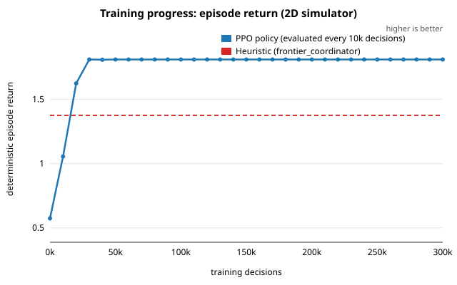
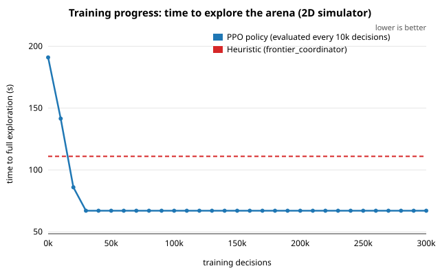
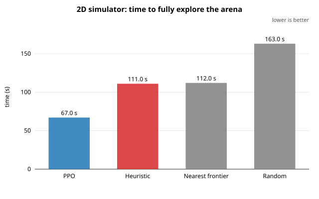
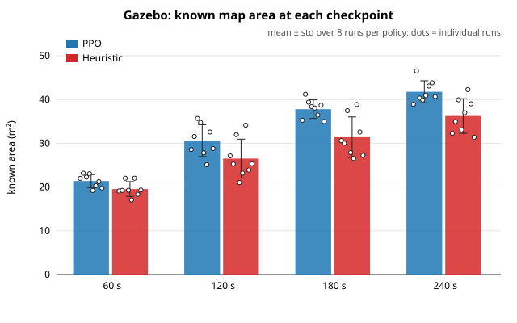
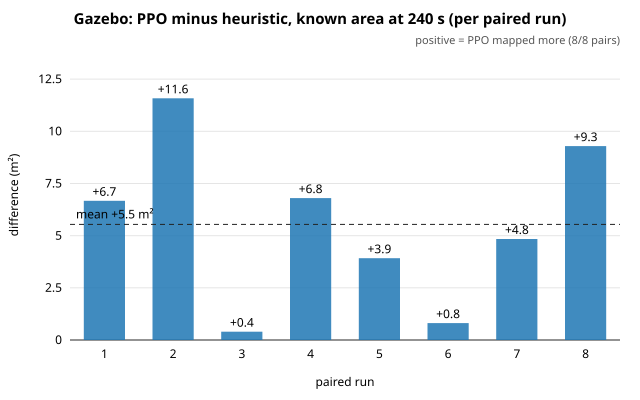
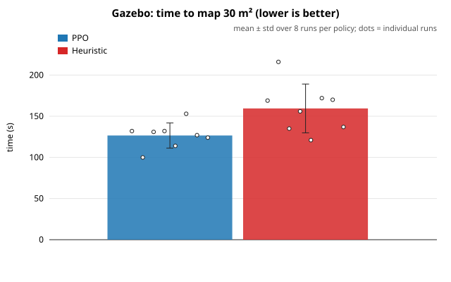
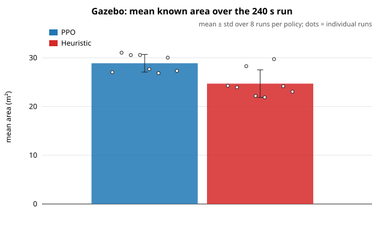
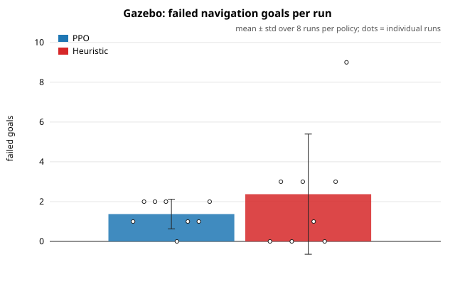
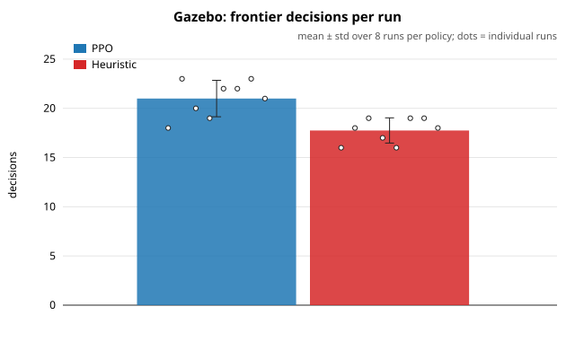

# Heuristic vs RL Frontier Selection

## Summary

A PPO frontier-selection policy, trained only in a lightweight 2D simulator of the benchmark arena, was transferred zero-shot to the full Gazebo/ROS 2 stack (two TurtleBot3s, slam_toolbox, map merging, Nav2). On the benchmark arena it **mapped faster than the hand-designed heuristic of `frontier_coordinator.py`**:

| | PPO | Heuristic | Difference |
|---|---|---|---|
| **Time to map 30 m²** (Gazebo, 8 paired runs) | **127 ± 15 s** | 160 ± 30 s | **−33 s (−21 %)**, PPO faster in **8/8** pairs, p = 0.008 |
| Known area at 180 s (Gazebo) | **36.7 ± 2.8 m²** | 32.4 ± 3.8 m² | +4.3 m² (+13 %), PPO ahead in **8/8** pairs, p = 0.008 |
| Known area at 240 s (Gazebo) | 41.3 ± 2.3 m² | 38.4 ± 2.2 m² | +2.9 m² (+7 %), 6/8 pairs, p = 0.055 (not significant) |
| Time to fully explore (2D simulator) | **67.0 s** | 111.0 s | −44 s (−40 %), deterministic |

All results were measured after the navigation fix described in [navigation-fix.md](navigation-fix.md). All charts are in [`../graphs/`](../graphs/), and raw data is in [`../results/`](../results/).

---

## 1. Setup

### 1.1 The decision being learned
When a robot needs a new goal, the coordinator picks one of the current frontiers (boundaries between mapped and unmapped space), and Nav2 drives the robot there. Only this choice differs between the two policies. Everything else is identical: frontier detection, goal handling, SLAM, map merging and Nav2.

- **Heuristic** (`frontier_coordinator.py`): picks the frontier with the lowest
  `cost = distance + 50 / dist(frontier, other robot's goal) + 50 · max(0, distance into the other robot's half)`.
- **PPO policy:** a 2×128 MLP that sees 12 candidate frontiers (nearest first) with 12 features each, plus 9 global features (153 numbers in total). It outputs which candidate to take; invalid slots are masked.

### 1.2 Training (rl_sim, 2D)
- **Arena:** parsed from the same world file Gazebo loads (`generate_random_world`), rasterised at 0.05 m.
- **Sensing and frontiers:** 360° lidar with 3.5 m range, and the coordinator's exact frontier detection.
- **Motion:** A* on a map inflated by 0.3 m (the robot radius plus a margin matching Nav2's inflation), at 0.15 m/s. Goals are kept at the same clearance.
- **RL formulation:**

  | Item | Value |
  |---|---|
  | Step | one frontier decision for one robot |
  | Reward | +0.1 per newly mapped m², −0.01 per simulated second |
  | Episode end | when nothing is left to explore |
  | Algorithm | MaskablePPO (sb3-contrib) |
  | Parallel envs | 8 |
  | Training length | 300k decisions (~25 min CPU) |

- **Convergence:** the policy was evaluated every 10k decisions. It passed the heuristic at 20k decisions, reached 67 s at 30k, and stayed at that level for the rest of training. Model: [`models/ppo_frontier_policy.zip`](../models/).




**PPO training curves** (TensorBoard log, also in [`results/training/`](../results/training/)):


They show clean convergence:
- **Reward:** the mean episode reward rises past the heuristic's and then stays flat.
- **Entropy:** policy entropy falls to ≈ 0, so the policy becomes confident.
- **Value function:** explained variance reaches ≈ 1.
- **Update size:** the KL divergence and clip fraction peak while the policy is changing, then drop to ≈ 0.

Individual charts: `../graphs/11_…` to `../graphs/19_…`.

### 1.3 Transfer to Gazebo (`rl_sim/ros_policy_node.py`)
Every second, the node rebuilds the training observation from the real system: the merged `/map` resampled onto the training grid, robot poses from TF, and the current Nav2 goals. It then runs the same decision code as in training. **Both policies run in this same node** (`--policy ppo` / `--policy heuristic`). The goal-ending rules are also identical for both: Nav2 success or failure, area around the goal fully mapped, or a 90 s timeout, with a 30 s blacklist for failed goals.

### 1.4 Gazebo protocol (`rl_sim/gazebo_test.sh`)
- **Each run:** a fresh headless stack: Gazebo on the benchmark arena, then SLAM, map merging and Nav2 (with the configuration from [navigation-fix.md](navigation-fix.md)). The policy runs for **240 s of simulated time**, and the merged map's known area is logged every second.
- **Design:** 8 PPO runs and 8 heuristic runs, **alternated** (PPO, heuristic, PPO, …), all on one laptop (8 cores / 32 GB). The k-th PPO run is paired with the k-th heuristic run, so slow drift in machine state affects both sides of a pair equally.
- **Statistics:** mean ± sample std, mean paired difference, and an **exact two-sided paired permutation (sign-flip) test** over all 2⁸ = 256 sign assignments. It makes no normality assumption. With 8 pairs, the smallest achievable p is 2/256 ≈ 0.0078.

---

## 2. Results

### 2.1 2D simulator (deterministic)
| Policy | Return | Time to explore fully | Decisions |
|---|---|---|---|
| **PPO** | **1.810** | **67.0 s** | 7 |
| Heuristic | 1.375 | 111.0 s | 9 |
| Nearest frontier | 1.361 | 112.0 s | 9 |
| Random (valid) | 0.856 | 163.0 s | 9 |



### 2.2 Gazebo (8 paired runs, 240 s each)
| Metric | PPO mean ± std | Heuristic mean ± std | Mean paired diff (PPO − H) | PPO better in | p |
|---|---|---|---|---|---|
| Known area at 60 s (m²) | 18.8 ± 1.8 | 17.3 ± 1.7 | +1.6 | 5/8 | 0.203 |
| Known area at 120 s (m²) | 28.5 ± 3.1 | 24.7 ± 3.1 | +3.8 | 7/8 | 0.023 |
| **Known area at 180 s (m²)** | **36.7 ± 2.8** | 32.4 ± 3.8 | **+4.3** | **8/8** | **0.008** |
| Known area at 240 s (m²) | 41.3 ± 2.3 | 38.4 ± 2.2 | +2.9 | 6/8 | 0.055 |
| Mean known area over 0–240 s (m²) | 27.7 ± 1.7 | 24.5 ± 2.1 | +3.2 | 7/8 | 0.016 |
| **Time to reach 30 m² (s)** | **126.6 ± 15.3** | 159.5 ± 29.6 | **−32.9** | **8/8** | **0.008** |
| Failed goals per run | 0.0 ± 0.0 | 0.4 ± 0.7 | −0.4 | — | 0.50 |
| Decisions per run | 21.1 ± 2.1 | 17.4 ± 1.9 | +3.8 | — | 0.016 |









**Per-run results** (known area in m² at 60 / 120 / 180 / 240 s, failed goals in brackets):

| Pair | PPO | Heuristic |
|---|---|---|
| 1 | 17.5 / 26.4 / 37.0 / 38.4 (0) | 17.1 / 22.6 / 31.4 / 35.2 (0) |
| 2 | 20.0 / 34.7 / 39.4 / 44.7 (0) | 13.5 / 19.4 / 25.4 / 36.2 (1) |
| 3 | 16.7 / 28.8 / 37.8 / 44.1 (0) | 17.1 / 27.3 / 37.4 / 40.5 (2) |
| 4 | 18.8 / 27.5 / 37.0 / 38.5 (0) | 17.0 / 24.4 / 34.4 / 38.3 (0) |
| 5 | 20.3 / 30.8 / 38.8 / 40.7 (0) | 18.9 / 29.6 / 35.9 / 41.0 (0) |
| 6 | 18.1 / 24.2 / 30.8 / 41.5 (0) | 18.5 / 25.6 / 30.0 / 38.2 (0) |
| 7 | 22.0 / 28.7 / 38.3 / 42.2 (0) | 17.2 / 23.2 / 31.1 / 37.1 (0) |
| 8 | 17.3 / 27.2 / 34.7 / 40.1 (0) | 18.8 / 25.7 / 33.7 / 40.9 (0) |

---

## 3. Analysis

### 3.1 What the numbers show
- **PPO maps faster.** It reached 30 m² sooner in **all 8 pairs**, by 33 s on average (−21 %, p = 0.008, the smallest p achievable with 8 pairs). It was ahead at 180 s in all 8 pairs (+4.3 m², p = 0.008), and its average known area over the whole run was 3.2 m² higher (p = 0.016).
- **The heuristic catches up late in the run.** At 240 s the gap shrinks to +2.9 m² (6/8 pairs, p = 0.055), because the arena is close to fully mapped and both policies are left with only small, scattered frontiers. The benefit of better frontier choice is therefore greatest in the middle of an exploration.
- **Not significant at 60 s** (5/8, p = 0.20). In the first minute both policies are still mapping the area around their starting points.
- **Navigation is now reliable for both.** PPO had no failed goals in any run, and the heuristic averaged 0.4. Before the navigation fix, robots often got pinned against obstacles: see [navigation-fix.md](navigation-fix.md).

### 3.2 Why PPO is faster (behaviour)
PPO makes **more, shorter trips**: 21 vs 17 decisions in the same 240 s. The heuristic's large penalties (50× for being near the other robot's goal, 50× per metre into the other robot's half) push it towards distant frontiers in its "own" half. The trained policy is willing to take nearer frontiers, and it redirects as soon as an area is mapped. In the 2D simulator it finished with fewer decisions (7 vs 9), choosing frontiers whose surroundings reveal more at once. Both behaviours reduce driving time per new m² mapped.

### 3.3 Transfer from 2D to Gazebo
| | 2D simulator | Gazebo |
|---|---|---|
| Area known at start | ~30 m² (ideal 360° scan) | ~4 m² (SLAM map builds up gradually) |
| Time to map most of the arena | ~70–110 s | > 240 s |
| PPO vs heuristic | −40 % time to full exploration | −21 % time to 30 m² |

Gazebo is 2–4× slower in absolute terms. slam_toolbox only integrates scans as the robots move, and Nav2 adds rotation and recovery time. The advantage transfers in direction but is smaller than in the 2D simulator: real navigation adds delays that don't depend on which frontier is chosen.

---

## 4. Limitations and threats to validity

1. **Arena.** Training and evaluation use the benchmark arena. Performance on other layouts was not measured, so no claim is made about them.
2. **Sample size.** 8 pairs is modest. The primary metrics (time to 30 m², area at 180 s) reach the smallest achievable p-value (0.008, 8/8 pairs). Metrics with p ≈ 0.02 would not all survive a strict multiple-comparison correction (8 metrics; Bonferroni α ≈ 0.006).
3. **240 s horizon.** Neither policy fully explored the arena within 240 s in Gazebo, so "time to full exploration" wasn't measured there.
4. **Same-node comparison.** The heuristic was run as a decision rule inside `ros_policy_node.py`, with the same goal handling as PPO. It was not run as the original `frontier_coordinator` node, whose goal handling differs (stuck detection, collision pausing, replanning every 3 s). The comparison isolates the decision rule, which is the claim being made.
5. **Simulation only.** This is sim-to-sim transfer, not tested on real robots.

---

## 5. Claim supported by this evidence

> A PPO frontier-selection policy trained in a lightweight 2D simulator of the benchmark arena, and transferred zero-shot to a Gazebo/ROS 2 multi-robot SLAM + Nav2 stack, mapped the arena **faster** than the hand-designed frontier heuristic. It reached 30 m² **21 % sooner** (127 vs 160 s) and had **13 % more area mapped at 180 s** (36.7 vs 32.4 m²). PPO was better in 8/8 paired runs on both metrics (exact paired permutation p = 0.008).

---

## 6. Reproduce

From `final-product/`, inside the ROS 2 environment:
```bash
colcon build --symlink-install
python3 rl_sim/train.py                                        # ~25 min, writes ~/rl_sim_runs/ppo_<time>/
python3 rl_sim/evaluate.py --model models/ppo_frontier_policy.zip   # 2D comparison
for i in $(seq 8); do                                          # ~90 min: 8 alternating Gazebo pairs
  rl_sim/gazebo_test.sh ppo 240 models/ppo_frontier_policy.zip
  rl_sim/gazebo_test.sh heuristic 240
done
python3 rl_sim/analyze_gazebo_tests.py                         # statistics (section 2.2)
python3 rl_sim/count_nav2_failures.py results/gazebo_runs      # navigation health
python3 rl_sim/make_graphs.py                                  # all charts in graphs/
```
**Raw data:**
- [`results/gazebo_runs/`](../results/gazebo_runs/): known area per second, one CSV per run
- [`results/training/eval_history.csv`](../results/training/): training evaluation curve
- [`results/sim2d/policy_comparison.csv`](../results/sim2d/): 2D simulator comparison
- `results/gazebo_runs_before_nav2_fix/`: the pre-fix runs, kept for reference
